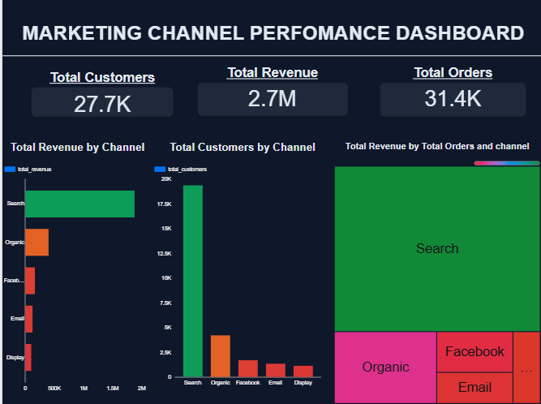
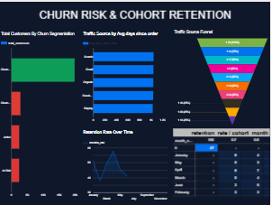

# Marketing Analytics dbt Project

## Overview
A production-style dbt project built on BigQuery, modelling marketing and customer data for a retail business.

## Stack
- **dbt** — data transformation and modelling
- **BigQuery** — cloud data warehouse
- **Looker Studio** — dashboarding and visualization
- **Git/GitHub** — version control

## Live Dashboard
🔗 [View Live Dashboard](https://lookerstudio.google.com/reporting/33236cc2-2028-4e3e-beac-07836e01f2e0)

## Dashboard Screenshots

### Marketing Channel Performance

### Churn Risk & Cohort Retention

## Key Insights
- Search is the highest revenue channel driving 2M+ in total revenue
- Organic is the second strongest channel by both customers and revenue
- High churn risk customers show significantly higher avg days since last order
- Cohort retention drops sharply after the first month indicating early engagement is critical

## Models
### Staging
- `stg_customers` — cleaned customer data
- `stg_orders` — cleaned orders data
- `stg_order_items` — cleaned order items

### Marts
- `mart_channel_performance` — revenue, orders and customers by marketing channel
- `mart_churn_risk` — customer segmentation by churn risk
- `mart_cohort_retention` — cohort retention analysis over time